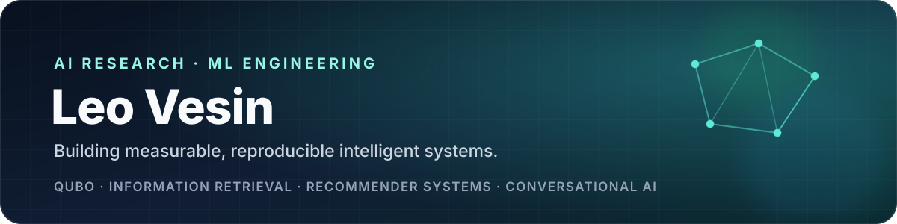

 

## Profile

AI and Computer Science student with research and engineering experience across **machine learning, QUBO optimisation, information retrieval, recommender systems and conversational AI**.

I completed two undergraduate years in Applied Artificial Intelligence at Innopolis University and worked as a Research Assistant at Q-Deep Research Lab. My work has included scientific literature review, mathematical formulation of optimisation problems, Python experimentation, dataset preparation, model evaluation, visualisation and technical documentation.

I care about systems that are **measurable, reproducible and honest about their limitations**.

## Selected work

<table>
<tr>
<td width="50%" valign="top">

### [SemanticSplat / Beyond Proximity](https://beyond-proximity-public.vercel.app)

Research prototype for graph-pruned semantic search in 3D Gaussian Splatting digital twins.

`semantic retrieval` `3D search` `evaluation` `research`

</td>
<td width="50%" valign="top">

### [NamazApp Support Recommender](https://github.com/LeoVesinML/namaz_recommender)

Transparent FAQ retrieval baseline using TF-IDF and similarity search, designed for explainable support recommendations.

`NLP` `information retrieval` `Flask` `Python`

</td>
</tr>
<tr>
<td width="50%" valign="top">

### [Voice AI](https://github.com/LeoVesinML/voice-ai)

Voice-first conversational application built with Next.js and modern speech/LLM integrations.

`TypeScript` `Next.js` `speech AI` `LLM integration`

</td>
<td width="50%" valign="top">

### [Verilog FFT](https://github.com/LeoVesinML/VerilogFFT)

Hardware-oriented Fast Fourier Transform implementation demonstrating digital design and algorithmic thinking.

`Verilog` `DSP` `digital systems` `algorithms`

</td>
</tr>
</table>

## Research and engineering experience

### Q-Deep Research Lab — Research Assistant

- Reviewed literature on quantum annealing, QUBO and hybrid classical–quantum optimisation.
- Helped translate optimisation problems into binary formulations with objectives, constraints and penalty terms.
- Implemented and evaluated experimental algorithms in Python.
- Analysed solution quality, computational efficiency and parameter sensitivity.
- Organised results, produced visualisations and documented limitations and possible improvements.

### MARS — Multi-Agent Recommender System for Namaz.app

Contributed to a completed team project focused on conversational AI and personalised recommendation. Worked with Python, FastAPI, asynchronous request processing and MongoDB, while gaining experience in API design, modular architecture, Git-based teamwork, testing, technical documentation, Docker and deployment.

[View the team repository](https://github.com/swp-team-1/MultiAgent-RecSys-for-Namaz.app)

## Recognition

- **Winner — Innopolis University Research Award 2025**
- Represented Innopolis University in **ICPC**
- **Top 8 — TechArena Kazan Challenge**, optimisation of 6G traffic
- **Finalist — Game AI Contest Arena (GAICA)**
- Participant — Singularity “Smart Breakthrough” blockchain hackathon
- Competitive arm wrestler and Top 250 in Russia in racketlon
- Founder of a poetry page with more than 15,000 readers

## Technical toolkit

<table>
<tr>
<td><strong>Machine learning</strong></td>
<td>Python, NumPy, Pandas, scikit-learn, PyTorch, model evaluation</td>
</tr>
<tr>
<td><strong>AI systems</strong></td>
<td>Information retrieval, recommender systems, conversational AI, reinforcement learning, GNNs, QUBO</td>
</tr>
<tr>
<td><strong>Backend and data</strong></td>
<td>FastAPI, Flask, MongoDB, SQL, Docker, asynchronous processing</td>
</tr>
<tr>
<td><strong>Frontend and product</strong></td>
<td>TypeScript, React, Next.js</td>
</tr>
<tr>
<td><strong>Engineering</strong></td>
<td>Git, Linux, testing, technical documentation, reproducible experimentation</td>
</tr>
</table>

## Working principles

- Build a transparent baseline before adding complexity.
- Measure quality with appropriate metrics instead of relying on demos alone.
- Document assumptions, limitations and failure cases.
- Keep experiments reproducible and claims proportional to evidence.
- Treat research communication as part of engineering quality.

---

### Open to AI research collaborations, internships and software engineering opportunities

**Turning research ideas into measurable, reproducible systems.**

